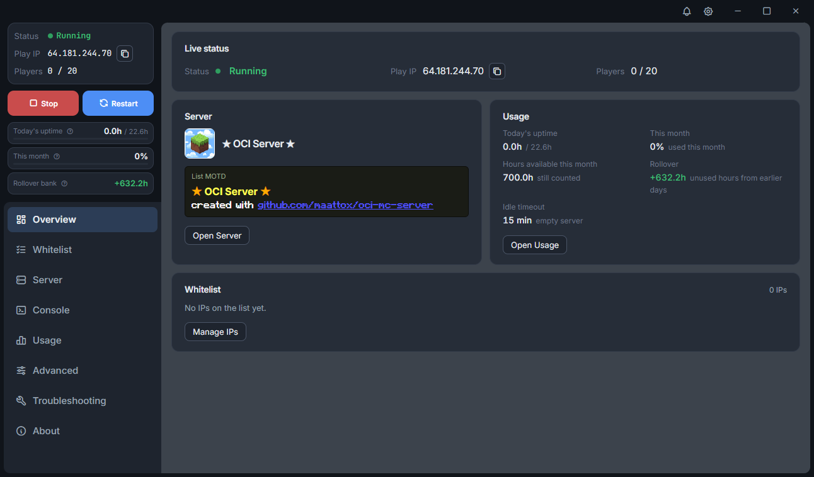

# MCSTool

Create a vanilla or modded Minecraft server using OCI Always Free resources.

### Setup guide: [docs/Guide.md](docs/Guide.md)

MCSTool does not browse or download packs for you. You supply the pack file. Supported formats are **Modrinth `.mrpack`**, **CurseForge Server Files**, and a **zip of `.jar` mods**. For a zip of jars, Setup asks you to confirm the loader, Minecraft version, and Java.

Always Free *can* work at **$0**, but Oracle **capacity often blocks creating the VMs**. Upgrading the account to **Pay As You Go (PAYG)** raises scheduling priority. You can still stay at $0 if you stay inside Always Free limits.

A Windows app for a **private Minecraft server** (modded or vanilla) for you and other players, hosted on [Oracle Cloud](https://www.oracle.com/cloud/). Built to run on Oracle’s Always Free resources.

**Open beta 0.9.1** — download it from [Releases](https://github.com/maattox/MCSTool/releases).

## What you get

- One app to create the server and manage it afterward
- Vanilla or modded server
- Players always join the same address
- When nobody is playing, the game server sleeps. A small always-on “doorbell” still answers Minecraft and can wake the server
- Only players whose IP you add in the app can connect
- Start and stop, the player list, usage, and world backups — all in the app

Windows only. There is no Mac or Linux app yet.

## Cost

The goal is **$0** using [Oracle Always Free](https://docs.oracle.com/en-us/iaas/Content/FreeTier/freetier_topic-Always_Free_Resources.htm#compute), and there are systems in place to automatically manage the server's uptime to ensure your account is not charged.

Oracle often requires a **Pay As You Go** account so the server can be created. That is for eligibility to create a VM, and does not require spending any money. If something ever goes wrong and a charge appears, a last-resort **$1 monthly limit** stops the game server. You might still see about **$1–$2 that month**. The [guide](docs/Guide.md) explains this in full.

## Get started

1. You need **Windows 10 or 11**, an [Oracle Cloud](https://cloud.oracle.com) account, and **Minecraft Java Edition**.
2. Download **MCSTool-Setup-0.9.1.exe** from [Releases](https://github.com/maattox/MCSTool/releases).
3. Windows may say the publisher is unknown. That is expected for this beta. Choose **More info** → **Run anyway** only if you downloaded the file from this project’s Releases.
4. Open **MCSTool** and follow Setup. The app will tell you if a Microsoft component is missing.

Step-by-step: [docs/Guide.md](docs/Guide.md).

## License

[MIT](LICENSE)
