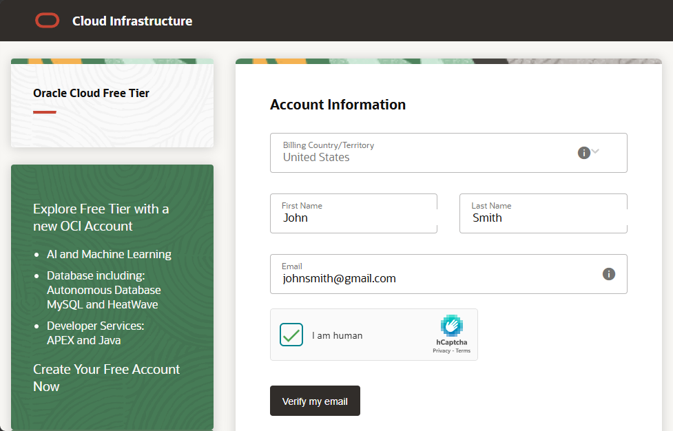
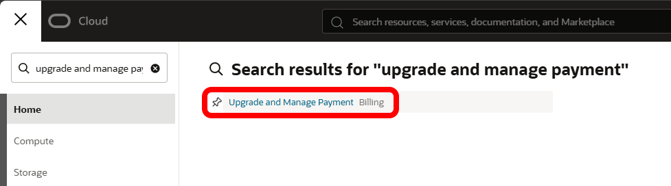
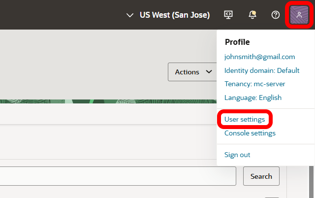
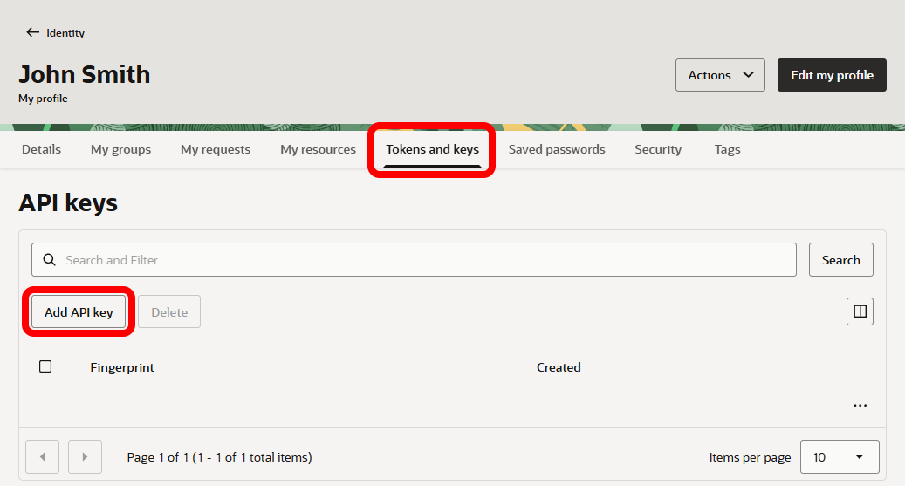
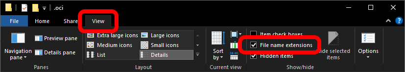
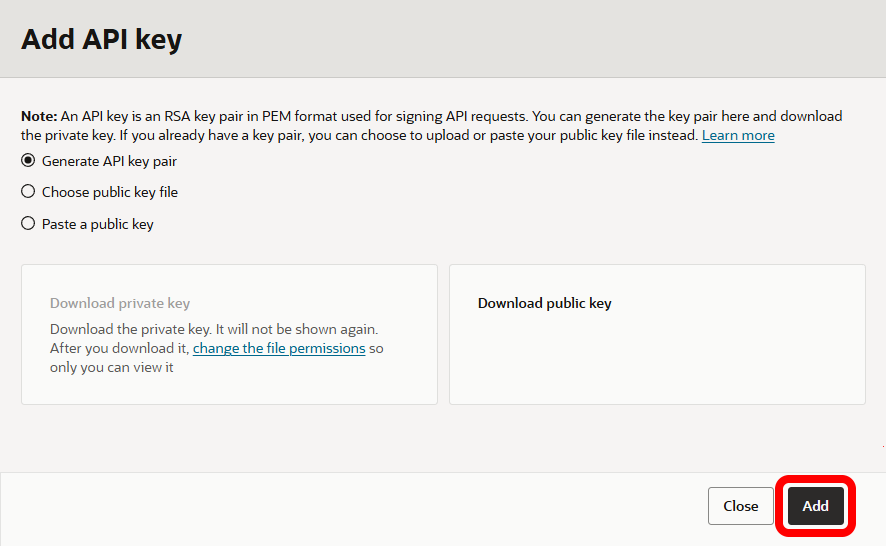
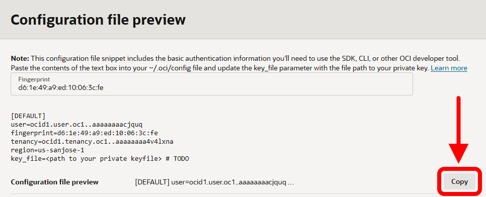
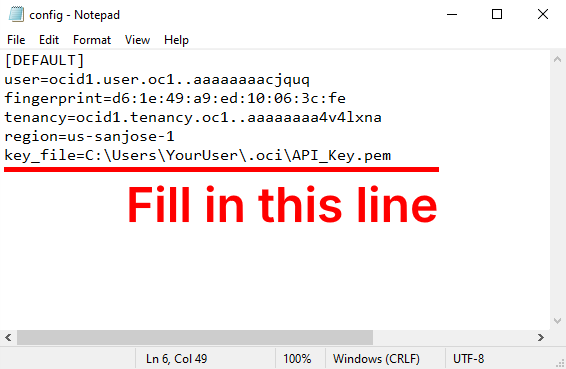
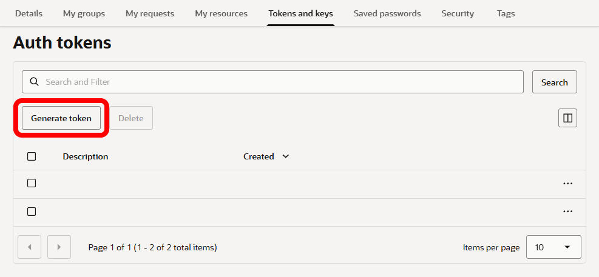
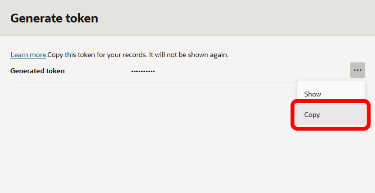

# Setup guide

This is the guide for setting up your Minecraft server with **MCSTool**, hosted on Oracle Cloud Infrastructure (OCI) using Always Free resources, and managed from one desktop app.

**Windows only.** There is no macOS or Linux MCSTool in this version.

MCSTool does not include an in-app pack browser. You supply the pack file. Supported formats are **Modrinth** `.mrpack`, **CurseForge Server Files**, and a **zip of** `.jar` **mods**. For a zip of jars, Setup asks you to confirm the loader, Minecraft version, and Java.

Always Free *can* work at **$0**, but Oracle **capacity often blocks creating the VMs**. Upgrading the account to **Pay As You Go (PAYG)** raises scheduling priority. You can still stay at $0 if you stay inside Always Free limits.

## What you need

- Windows 10 or 11
- An [Oracle Cloud](https://www.oracle.com/cloud/) account (you will create one in Part 1)

## Cost

The goal is **$0** using Oracle [Always Free](https://docs.oracle.com/en-us/iaas/Content/FreeTier/freetier_topic-Always_Free_Resources.htm#compute) resources.

Oracle still requires **Pay As You Go (PAYG)** in many regions so the Ampere game server can be created. That is for **eligibility**, not permission to spend. Always Free resources stay free after the upgrade; you are charged only for usage **above** those limits. There are several mechanisms in place to ensure your account usage does **not** exceed those limits so you will not be charged.

Setup also creates a last-resort **$1 monthly budget**. If spend ever reaches $1, a Function stops the game server. That brake is not instant, so you might still see about **$1–$2 that month**, then no further charges while it holds.

---

## Part 1 — Create an Oracle Cloud account and upgrade to PAYG

### 1. Create a free account

1. Sign up at [signup.oraclecloud.com](https://signup.oraclecloud.com/).

- For a detailed walkthrough, use Oracle’s [account creation guide](https://docs.oracle.com/en/learn/get-started-with-oci-and-oci-console/index.html#introduction).
- You start with a free account. The next step upgrades it to PAYG.

### 2. Upgrade to Pay As You Go (PAYG)

1. Open the navigation menu in the top left of the OCI Console.
2. Search for and select **Upgrade and Manage Payment**.

1. Under **Pay As You Go**, review your information and click **Upgrade your account**.
2. Review the confirmation and click **Upgrade account**.
3. The upgrade can take a day or two. Oracle emails you when it is complete.

> **Credit-card authorization:** when you upgrade to PAYG, your card is authorized for **$100 USD** (or the equivalent in your country). Oracle reverses that authorization immediately on their side. Your bank decides how long the reversal takes to show up.

---

## Part 2 — Create an API key and Auth Token

### 1. Create and download the API key

1. Click the profile icon in the top right of the OCI Console.
2. Select **User settings**.

1. Open the **Tokens and keys** tab and click **Add API key**.

1. Select **Generate API key pair**.
2. On your PC, create a folder named `.oci` at `C:\Users\YourUser` (use your Windows user name).
3. In that folder, create a file named `config` with **no file extension**. To do that, enable **File name extensions** in File Explorer, then create and rename a text file and remove `.txt`.

1. Download the **private** and **public** keys and move both files into `C:\Users\YourUser\.oci`.
2. Back in the OCI Console, click **Add**.

1. Copy the configuration file preview.

1. Open the `config` file in a text editor and paste the snippet.
2. Set the `key_file` line to the full path of the **private** key in your `.oci` folder. Your file name will be different from the example.

1. Save the file.

### 2. Create the Auth Token

1. On the same **Tokens and keys** page, under **Auth tokens**, click **Generate token**.

1. Enter any description and click **Generate token**.
2. **Copy the token immediately** and save it somewhere safe. You will paste it into the Setup wizard later. Oracle will not show it again.

---

## Part 3 — Run the Setup wizard

### Download and install

1. On the [GitHub repo](https://github.com/maattox/MCSTool), open the latest **MCSTool** release under **Releases**.
2. Download and run the setup `.exe`.

- The installer is not signed. Windows Defender / SmartScreen may show **Windows protected your PC**. Choose **More info** → **Run anyway**.

1. If MCSTool says a Microsoft component is missing, install [Evergreen WebView2](https://go.microsoft.com/fwlink/p/?LinkId=2124703), then open the app again.

### Walk through the wizard

1. Open **MCSTool**. On first launch, select **Deploy a new stack**.
2. Work through the pages:

**Step 1 — Disclaimers**  
Read them and confirm you understand them. This includes Always Free limits and the $1 last-resort budget.

**Step 2 — OCI profile and email**  
Select your OCI profile and enter an email. The profile should be detected automatically if you finished Part 2. The email is only used to alert you if the $1 budget is triggered.

**Step 3 — SSH key**  
Generate a new key, or import an existing one. This is **not** the API key from Part 2. Setup can use one key for both VMs or a different key for the door.

**Step 4 — Server type**  
Choose **Vanilla** or **Modded**.

- Supported pack formats: Modrinth `.mrpack`, CurseForge **Server Files**, or a `.zip` of `.jar` mods (you may need to confirm some details about the pack).
- Supported loaders: Fabric, Forge, NeoForge.
- Large packs with heavy mods will lag on this VM. In particular, skip **Distant Horizons** — generating new chunks on this size of VM causes significant lag.
- You can change the pack later from MCSTool.
- **Modded:** players need **that same exported pack file** on their PCs.

**Step 5 — Server identity**  
Set the name, description, and icon players see in the Minecraft server list. You can change these later.

**Step 6 — Minecraft EULA**  
Open and accept the [Minecraft EULA](https://aka.ms/MinecraftEULA).

**Step 7 — Auth Token**  
Paste the Auth Token you saved in Part 2 and store it.

**Step 8 — VM size and deploy**  
Pick a size and start deployment.

- Deployment often takes **10–25 minutes**, depending on VM size and pack. Leave the app open until it finishes.
- If Deploy is interrupted after the game VM already exists, that VM may stay on. Finish Setup, or stop it in the OCI Console (especially the 4 OCPU / 24 GB size).
- The recommended size (**4 OCPU / 24 GB**) can only run about **~11.5 hours a day** on average over a month. MCSTool’s usage stats make that easy to track.
- The smaller size (**2 OCPU / 12 GB**) can usually stay on all month, with less room for mods and players.

#### When deployment completes, click **Close** to enter MCSTool.

---

## Start playing

The Minecraft server should now be up. Copy the **play IP** from MCSTool and connect from Minecraft Java Edition.

- Your public IP is allowlisted during Setup. To allow other players, add each player’s **current public IPv4** on the **Whitelist** tab and click **Save changes**. Home IPs can change; update the list when they do.
- **Modded:** also give players the **same mod pack file** you chose in Setup.

### Players tab

On the **Players** tab:

- **Online now** shows who is connected (name and face). Start the server to see the list.
- Hover a row for **Kick** (optional reason), **Mod** / **Unmod**, and **Ban** (confirm + optional reason).
- **Banned** lists in-game banned players under **Online now**. Hover **Unban** (`pardon`). This still does not change **Whitelist** / Who can join.
- **Ban** is Minecraft’s in-game ban only. It does **not** change **Whitelist** / Who can join (the cloud IP allowlist). An in-game `/ban` from another operator also does not update that list.

### Server tab

On the **Server** tab:

- **Identity** — name, description, and icon in the Minecraft server list.
- **Settings** — difficulty, default game mode, max players, view distance, simulation distance (Minecraft 1.18+), PvP when that version still has a `pvp` property, spawn protection, hardcore, force game mode, and allow flight. **Save**, then **Restart** (or **Start**) so Minecraft reads the file. Name and MOTD stay on Identity.

### Idle stop and wake

- The game server turns off after **15 minutes** with no players. That is how the app stays inside Oracle’s free-hour allowance. The doorbell stays on and keeps the same play IP.
- When the server is off, it can be started from MCSTool, or by a player attempting to connect from the Minecraft client. The doorbell then starts the server VM. Wake can take **2–5 minutes**, depending on the pack and world.

